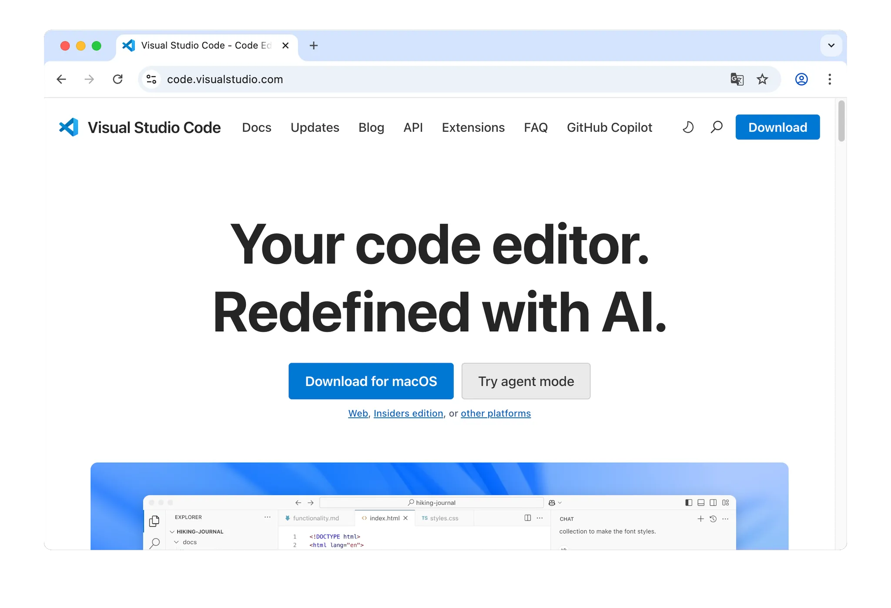
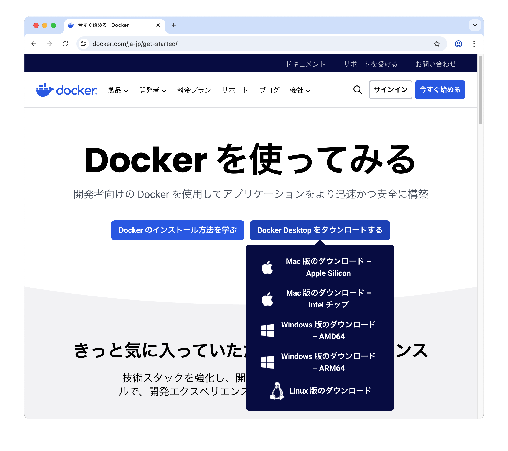
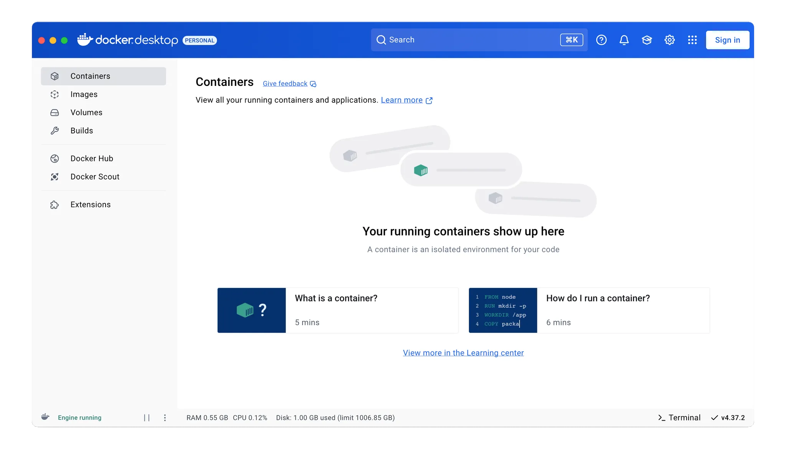
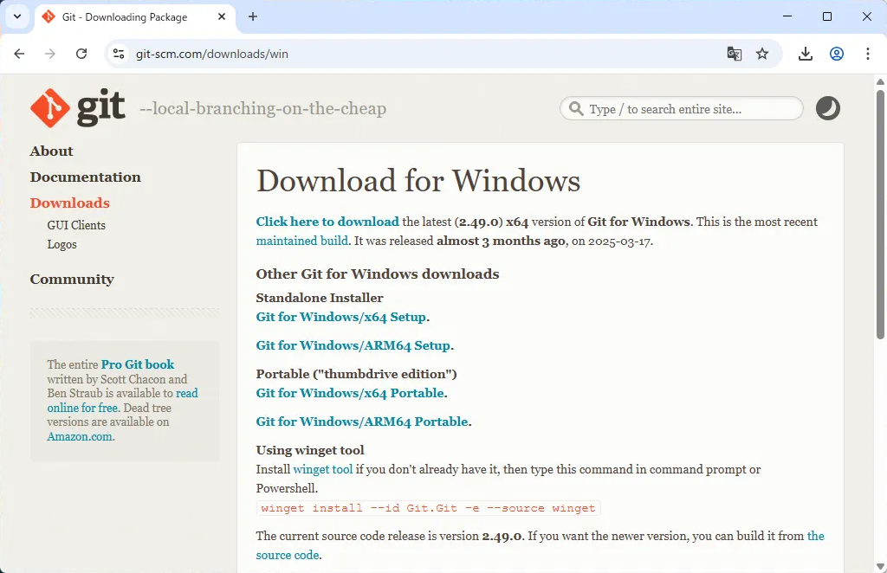
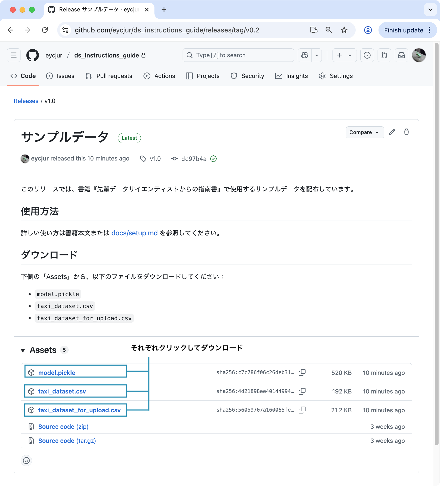
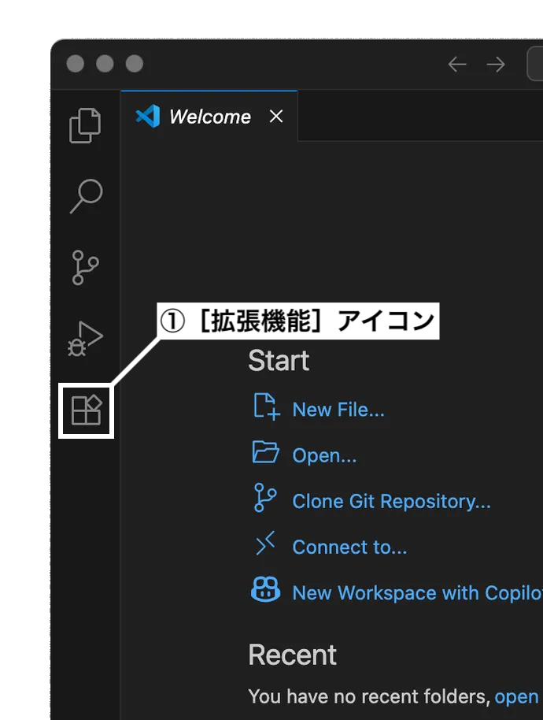
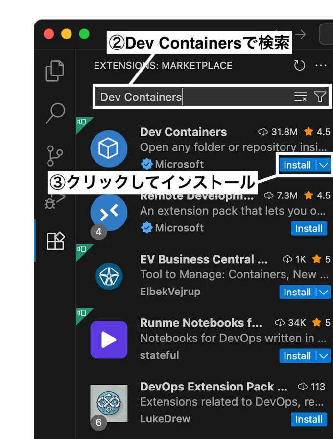
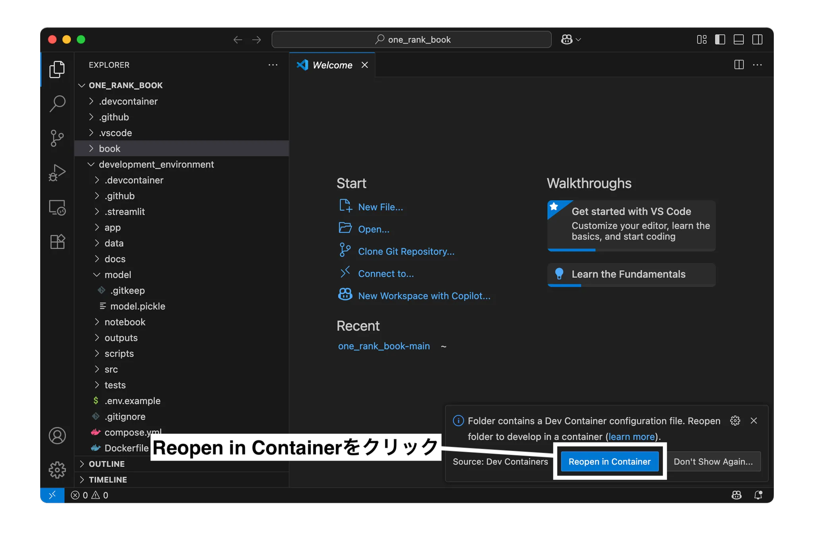
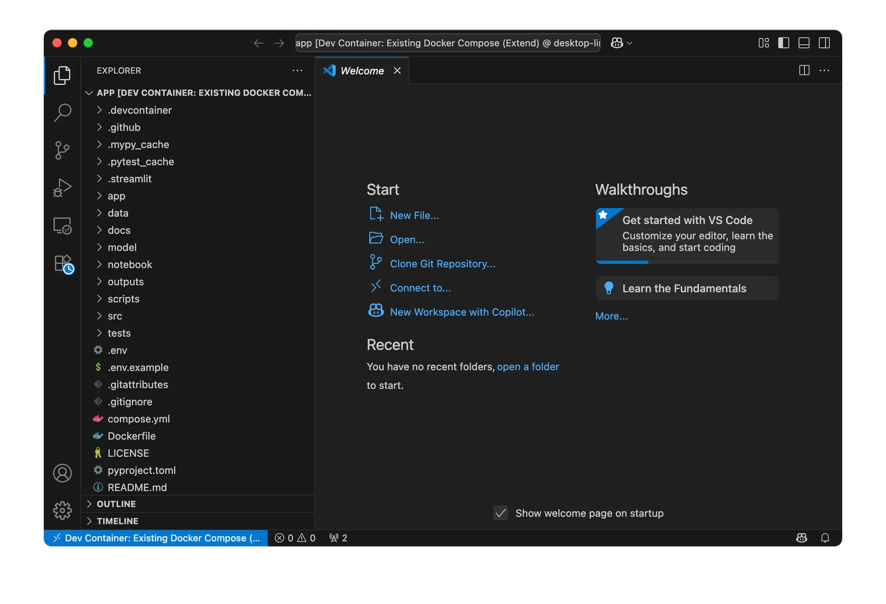

# 本書で必要な環境構築

本書では、ハンズオン形式で実際にコードを動かしながら学習を進めることができます。以下では、ハンズオン実施のために必要な環境構築の手順を記載します。この準備を行うことで、4章のデータ確認から5章の実験管理、6章のプロトタイプ開発までの一連の流れを、実践的に学ぶことができます。

環境構築には、主に以下の3つのツールを使用します。

- **Visual Studio Code (VS Code)**：軽量で拡張性に優れた統合開発環境 (IDE) で、多くのプログラミング言語やツールに対応しています。
- **Docker**：アプリケーションの実行環境をコンテナとしてパッケージ化し、他の開発者と同じ環境を簡単に再現できる仕組みを提供します。
- **Git**：ソースコードや設定ファイルを管理するための分散型バージョン管理システムです。

それでは環境構築を実施していきましょう。

## 環境構築の手順

以下の手順で環境構築を実施します。

1. 各種ツールのインストール
2. リポジトリのクローン
3. 必要なファイルのダウンロード
4. 環境変数の設定ファイルの用意
5. Dev Containerでの開発環境の立ち上げ


### 1. 各種ツールのインストール

##### VS Codeのインストール

本書では、IDE（統合開発環境）としてVisual Studio Code（以下VS Code）を採用しています。VS CodeはMicrosoft社が開発しているオープンソースのIDEで、他のIDEと比べて起動速度が速く、動作が軽量です。また拡張機能も豊富に揃っているため、効率的に開発を進めることができます。

VS Codeの公式サイト[^vscode-home]からお使いのOSに応じたインストーラーをダウンロードし、端末にインストールを行ってください（図1）。

[^vscode-home]: https://code.visualstudio.com/

<p align="center">
  
</p>
<div align="center">
  ▲図1／VS Codeのホームページ（macOSの場合）
</div>
<br>

##### Docker Desktopのインストール

続いて、Dockerを使用するための準備を行います。Dockerは、アプリケーションを動かすための環境を「コンテナ」としてまとめて管理、実行できるツールです。

本書ではDocker DesktopをインストールしてDockerの実行環境を構築します[^docker-caution]。Docker DesktopはGUI、Docker Engine、Docker CLI、Docker Composeなどのツールが一つにまとまったパッケージであり、Docker Desktopをインストールするだけで本書で必要な準備が整います。

[^docker-caution]: Docker Desktopは、個人利用および中小企業であれば無料で利用可能です。
ただし、従業員数が250人以上または年間収益が1,000万ドルを超える企業で商用利用する場合は、有料のサブスクリプションへの加入が必要となります。

Dockerの公式サイト[^docker-home]からお使いのOSに応じたインストーラーをダウンロードし、端末にインストールを行ってください（図2）。

[^docker-home]: https://www.docker.com/ja-jp/get-started/

<p align="center">
  
</p>
<div align="center">
  ▲図2／Dockerのホームページ
</div>
<br>

Docker Desktopのインストールが完了したら、起動を行ってください。初回起動時にはいくつかの確認事項が表示されますが、図3の画面が表示されれば、セットアップは完了です。

<p align="center">
  
</p>
<div align="center">
  ▲図3／Docker Desktopの起動画面
</div>
<br>

##### Gitのインストール

続いてGitのインストールを行います。Gitはコードのバージョン管理を行うためのツールです。

- Windowsの場合

Windows用のGitのダウンロードサイト[^git-download-win]からインストーラーをダウンロードし、端末にインストールを行ってください（図4）。

[^git-download-win]: https://git-scm.com/downloads/win

<p align="center">
  
</p>
<div align="center">
  ▲図4／Windows用Gitのダウンロードサイト
</div>
<br>

なお、コマンドプロンプトまたはPowerShellで`winget`コマンドが利用できる場合は、以下のコマンドを実行してインストールすることも可能です。

```bash
winget install --id Git.Git -e --source winget
```

- macOSの場合

macOS用のパッケージマネージャーであるHomebrew[^homebrew-home]を通してインストールを行います。お使いの端末にHomebrewがインストールされていない場合は、ターミナルから以下のコマンドを実行してインストールを行ってください。

```bash
# Homebrewのインストール
/bin/bash -c "$(curl -fsSL https://raw.githubusercontent.com/Homebrew/install/HEAD/install.sh)"

# パスを通す
echo 'eval "$(/opt/homebrew/bin/brew shellenv)"' >> ~/.zprofile
eval "$(/opt/homebrew/bin/brew shellenv)"
```
[^homebrew-home]: https://brew.sh/ja/

Homebrewがインストールされたことを確認したのち、以下のコマンドを実行してGitのインストールを行なってください。
```bash
brew install git
```

なお、その他のインストール方法について確認したい場合は、macOS用のGitのダウンロードサイト[^git-download-mac]から確認してください。

[^git-download-mac]: https://git-scm.com/downloads/mac

### 2. リポジトリのクローン

本書で提供しているリポジトリをローカル環境にクローンします。適当なディレクトリに移動して以下のコマンドを実行してください。

```bash
git clone https://github.com/eycjur/ds_instructions_guide.git
```

クローンが完了したら、リポジトリをVS Codeで開いてください。

### 3. 必要なファイルのダウンロード

本書で使用するファイルをダウンロードします。以下のリンク先から、学習済みモデル`model.pickle`および、サンプルデータ`taxi_dataset.csv`と`taxi_dataset_for_upload.csv`の3つのファイルを取得してください（図5）。
- https://github.com/eycjur/ds_instructions_guide/releases

<p align="center">
  
</p>
<div align="center">
  ▲図5／必要なファイルのダウンロード
</div>
<br>

`model.pickle`はリポジトリ内の`model`ディレクトリに保存してください。`taxi_dataset.csv`はリポジトリ内の`data`ディレクトリに保存してください。`taxi_dataset_for_upload.csv`は6章でStreamlitアプリケーションにアップロードして使用します。

### 4. 環境変数の設定ファイルの用意

リポジトリのルートディレクトリに存在する`.env.example`ファイルをコピーして、同一の階層に`.env`という名前のファイルを作成してください。
ファイルの内容は`.env.example`と同一のままで問題ありません。

### 5. Dev Containerでの開発環境の立ち上げ
まず、開発環境の構築に必要な拡張機能「Dev Containers」のインストールを行います。
VS Codeの左側にあるサイドバーから「拡張機能 (Extensions) 」アイコンをクリックして、拡張機能の一覧を開きましょう。検索バーが現れますので、「Dev Containers」と入力します。結果に表示された「Dev Containers」をインストールしてください（図6）。

<div style="display: flex; justify-content: center; gap: 20px;" align="center">
  
  
</div>
<div align="center">
  ▲図6／拡張機能「Dev Containers」のインストール
</div>
<br>

リポジトリを開くと、VS Codeの右下に図7のようなポップアップが表示されます。「コンテナーで再度開く (Reopen in Container) 」をクリックすると、Dev Containerが起動し、開発環境が自動で構築されます。

<p align="center">
  
</p>
<div align="center">
  ▲図7／Dev Container起動時のポップアップ
</div>
<br>

もし前述のようなポップアップが表示されない場合は、VS Codeのコマンドパレット（Windows: `Ctrl + Shift + P`、macOS: `Command + Shift + P`）を開き、「Dev Containers: Reopen in Container」を選択することで、同様に起動することができます。

VS Codeの左下に「Dev Container: ...」と表示され、サイドバーのエクスプローラー (Explorer) に各種ファイルが表示されていれば、本書で使用する開発環境の構築は完了です（図8）。

<p align="center">
  
</p>
<div align="center">
  ▲図8／環境構築完了時の画面
</div>
<br>
